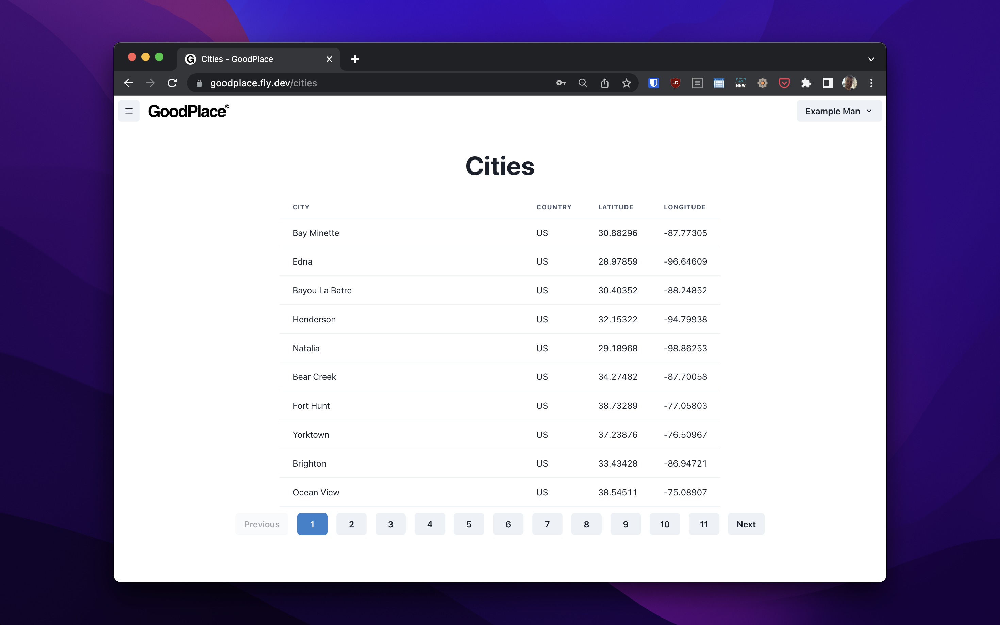

# GoodPlace

A project template using clojure, clojurescript, reitit, inertiajs, chakra-ui, playwright, postgres, fly.io and capacitorjs. Heavily inspired by [Michael Sahili's](https://github.com/prestancedesign) version of [PingCRM](https://github.com/prestancedesign/pingcrm-clojure) and using [inertia-clojure](https://github.com/prestancedesign/inertia-clojure).

## Introduction

GoodPlace attempts to be a project that forms a good starting point for simple, high quality web applications. It follows a [Backend for Frontend](https://medium.com/mobilepeople/backend-for-frontend-pattern-why-you-need-to-know-it-46f94ce420b0) approach facilitated by inertiajs, we disregard REST, GraphQL et al in favour of inertia's simple model of returning data for a given page either within the rendered html or a simple json payload depending on how it's loaded (read more in inertia's [documentation](https://inertiajs.com/how-it-works)). It still allows us to use modern js frameworks to build components and frontend behaviour.

_It's definitely a young project so there might be rough edges, please file and issue if you have trouble running things._

## Rationale

### Why separate backend and frontend directories?

It's common to see clojure code bases with frontend and backend parts share the same space and sometimes even the same deps file. This can be tricky and lead to a lot of conditional behaviour. IMO it's better to keep different things completely separate and share explicitly when required.

The shared directory contains all the application routes that are used amongst other things, and we can join our relevant backend handlers and frontend components to them easily whilst maintaining a consistent repository of what routes are avaiable in one place.

## Guides

### Adding a new page or route

There are some distinct types of route to be aware of within inertia:
 * A plain page component, which we can tell inertia to render with no additional data required
 * A page with data, in our server handler we will need to supply props to be used by the page component and use the `usePage` hook to retrieve
 * A route with no corresponding page, typically non-GETs, we can return a redirect response 303 with any necessary data added to flash data for the page

1) Add it to `goodplace.shared.routes`
2) Depends on the type of page or route
    * For a plain page you can:
      1) add a page component, maybe in `goodplace.pages.<something>`
      2) add a join to your new component via `goodplace.pages/page-components`
      3) add an entry to `goodplace.handlers/handlers` for the same id, it can just use `(inertia-handler <id>)`
    * For a page and a route you can follow the steps for a page but add
      additional handlers for other methods
    * For a route with no corresponding page you can add the handlers
3) Inertia caches root components so you may need to refresh to see changes (correct me if I'm wrong)

### Running capacitor

## Todo

- [x] Add easy running of cljs, js parts
- [x] Add authentication for routes
- [x] Add basic tests
- [x] Add user management
- [x] Reimplement cljs friendly hooks for inertia
- [x] Fork out inertia wrapping into new library
- [x] Add titles to pages
- [x] Produce jar of application
- [x] Deployment (fly.io)
- [x] Improve error feedback development time
- [x] Add local postgres
- [x] Separate handlers into namespaces
- [x] Use postgres for notes too
- [x] Remove old sqlite implementations
- [x] Fix broken symbols in prod
- [x] Use production postgres
- [x] Separate pages into namespaces
- [x] Mobile/Responsive views
- [x] CapacitorJS?
- [x] Improve tests
- [x] Reduce bulk of pages namespaces
- [x] Improve documentation
  - [x] High Level Description
- [x] Improve appearance of side menu
- [x] Import database changes
- [x] Import logging changes
- [ ] Import authorization changes
- [ ] Import malli validation
- [x] Ensure we don't scrap the database on every reset
- [ ] Create a dashboard-like page
- [ ] Create a scaffolder for new routes
- [ ] Create a generator that can produce copies of this app elsewhere
- [ ] Improve build
- [ ] Improve usability
  - [ ] Out of the box run test
- [ ] Add rationale for GoodPlace
- [ ] CI tests (Github Actions)
- [ ] Add individual pages for server errors
